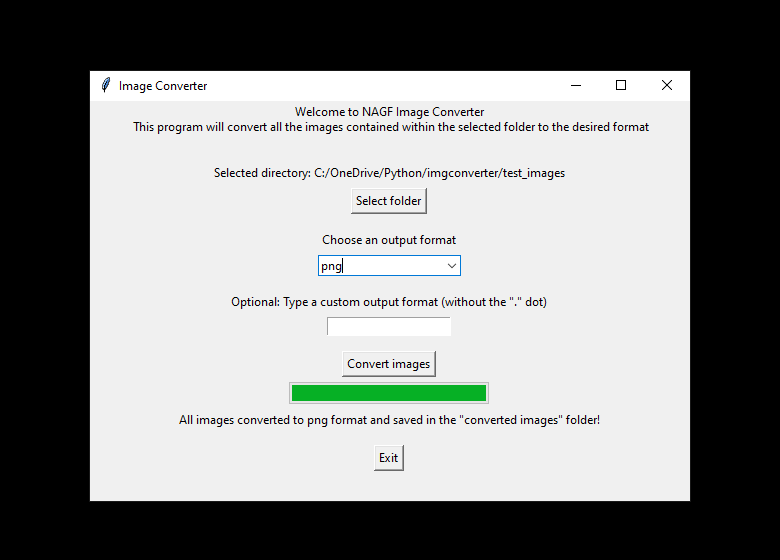

# NAGF Image Converter

Simple image format converter built on Python 3.10.8 using tkinter & pillow libraries. This software is meant to process all the images contained within a specific folder and convert them to a desired format. Supports the popular formats .jpg, .jpeg, .gif, .png, .bmp, .tiff and .webp by default, and can also work with many other custom formats typed by the user.

The repository includes:
* Source code of the software.
* Alternative version of the software implementing opencv (converter_cv.py)
* Test images of different formats.
* Screenshots of the software running on Windows 10.
* Standalone executable.
